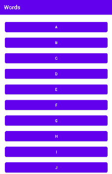

<h1 align="center"><b>📖 Words 📖</b></h1>
<h2 align="center">Um Dicionário de Waifus</h2>
<h2>Sobre o Aplicativo</h2>
O aplicativo é como um dicionário de waifus, você escolhe uma leta e irá listar as waifus que tem as iniciais com essa letra(no momento só há 2 waifus por letra).
Ao selecionar a waifu selecionada, o usuário será direcionado para o Google com a pesquisa da personagem selecionada.
<h2>Sobre o Projeto</h2>
O projeto foi desenvolvido a partir da sala de aula, com fins educacionais. O objetivo era trazer o que nós aprendemos até agora na sala de aula criando um dicionário com no mínimo 2 objetos,
foi então que eu decidi fazer usando waifus.
  
Desenvolvido usando Kotlin no Android Studio.
<h2>Demonstração</h2>

  
  

<h2>Criador</h2>
Feito por <a href="https://github.com/Caioaraujo48">Mim, Caio</a>
